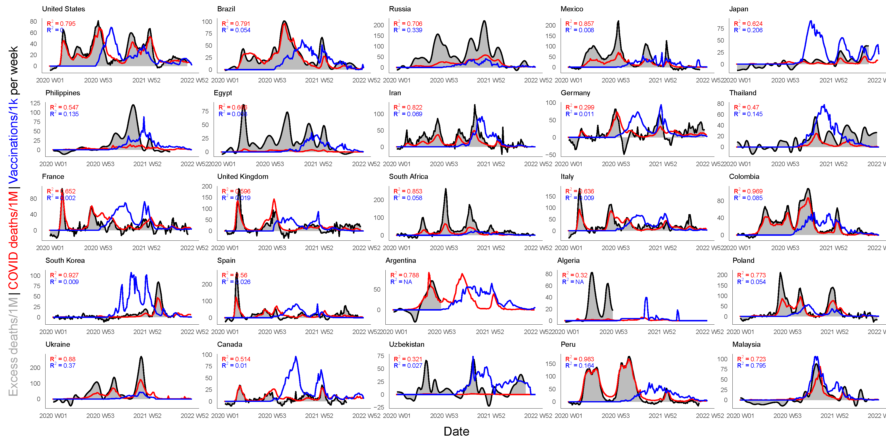
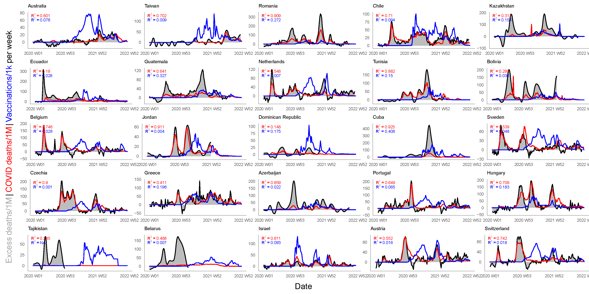
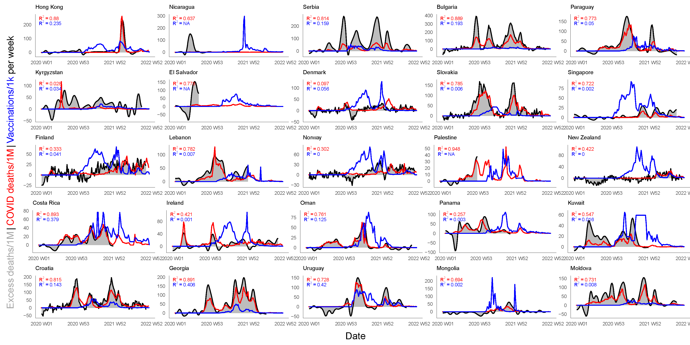
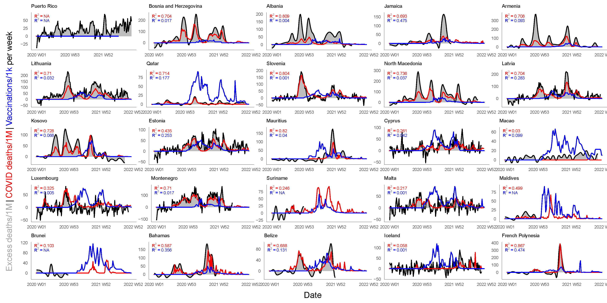
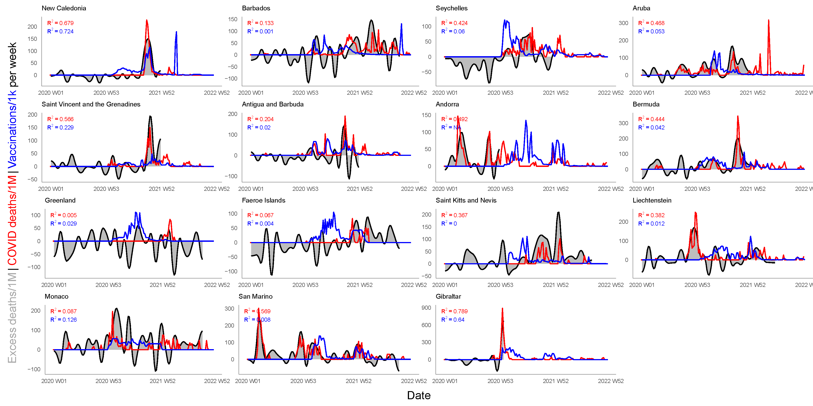

# Excess mortality - COVID19 or vaccines?

Latest data for 100 countries below. Decide for yourself, what does the data tell you.

# Data sources

* **Excess mortality**
  Excess mortality data is estimated by [Karlinsky & Kobak, 2021, Tracking excess mortality across countries during the COVID-19 pandemic with the World Mortality Dataset. *eLife* 10:e69336](https://elifesciences.org/articles/69336). As this is a key part of the visualization, the reader is encourage to read the article to understand the applied methodology. The data is continuously kept up to date by the authors at https://github.com/dkobak/excess-mortality/.

* **Vaccination rates** and **COVID-19 deaths** 
  Both vaccination rates and reported COVID-19 deaths data is obtained from Our World In Data directly from their GitHub repository (https://github.com/owid/covid-19-data/raw/master/public/data/owid-covid-data.csv).

# How to use

1. Update the data by running `update.R` from the [data_raw](data_raw) subfolder. The country stringency data must be manually downloaded (link and instructions in the source code).
2. Pre-process the data by running `preprocess_data.R` from the [data_proc](data_proc) subfolder.
3. Run the `mortality.R` script to generate the plots.

# Pre-processing

The excess mortality and vaccination data for the various countries is not provided on the same time interval, e.g. some countries report daily, others weekly, and others only monthly or even only quarterly. Temporal diss-aggregation and/or aggregation is therefore used to bring data on the same time scale. While temporal aggregation is straightforward, the [Denton-Cholette](https://journal.r-project.org/archive/2013-2/sax-steiner.pdf) method of temporal diss-aggregation is used.

